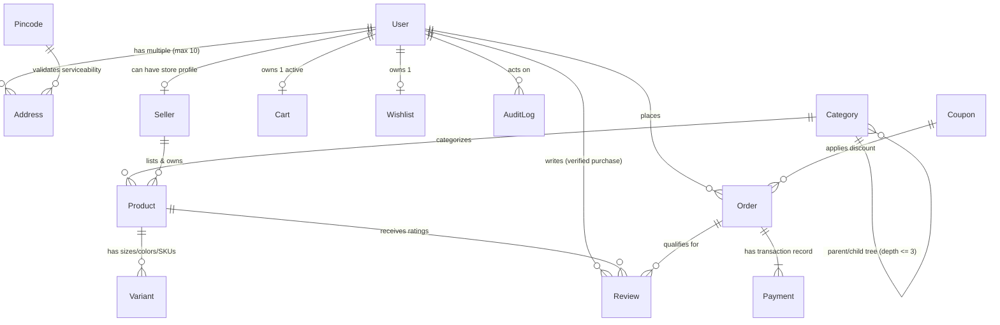
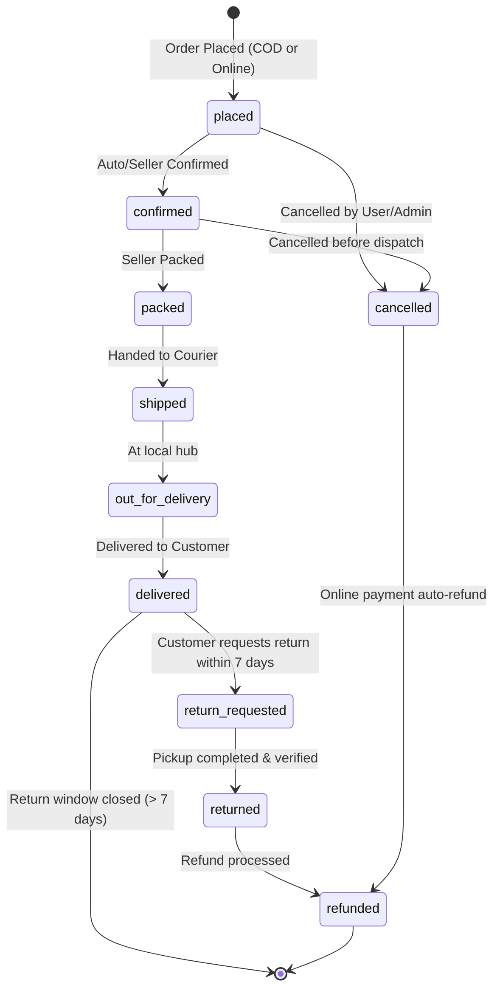

# Full-Stack E-Commerce Marketplace Backend Architecture Plan
**Project Codename:** *VerveMarket (Independent Multi-Category Marketplace)*  
**Specification Version:** `1.0.0`  
**Target Runtime:** Node.js 20 (ES Modules) + Express 5 + MongoDB / Mongoose

---

## 1. System Overview & Core Architecture Rules

### 1.1 Core Principles
- **Layered Clean Architecture**: Strict unidirectional flow:
  `Routes -> Middlewares -> Controllers -> Services -> Models`
  Controllers handle request/response orchestration; business logic resides strictly in Services; data access & hooks reside in Models.
- **Unified Response Envelope**:
  ```json
  {
    "success": true,
    "message": "Operation description",
    "data": {},
    "meta": {
      "page": 1,
      "limit": 20,
      "total": 100,
      "totalPages": 5
    }
  }
  ```
- **Error Standards**: All errors handled via `ApiError(statusCode, message, errors, errorCode)`. No leaked stack traces in production. Machine-readable error codes (`OUT_OF_STOCK`, `INVALID_CREDENTIALS`, `COUPON_EXPIRED`, `UNAUTHORIZED_ACCESS`, `STATE_CONFLICT`, etc.) for frontend branching.
- **Monetary Values**: All money stored as integers in minimum currency units (e.g. Paise for INR: ₹100.50 = `10050`). No floating-point rounding errors.
- **Soft Deletes**: Product, Category, User, and Seller models utilize `isDeleted: Boolean` and `deletedAt: Date`.
- **Query Standards**: Every collection list endpoint enforces pagination (`page`, `limit`, `sort`, `search`, `fields`). Unbounded array queries are prohibited.

---

## 2. Entity-Relationship Diagram (ERD)

### 2.1 Visual Mermaid ERD



### 2.2 Text / Schema Specification

```text
================================================================================
                                USER & AUTH
================================================================================
User
  ├── _id: ObjectId [PK]
  ├── name: String (trimmed, min 2, max 100)
  ├── email: String [Unique, Indexed, Lowercase]
  ├── phone: String [Unique, Sparse, Indexed, E.164]
  ├── passwordHash: String [Excluded by default in queries]
  ├── role: Enum ["customer", "seller", "admin"] (default: "customer", Indexed)
  ├── avatar: { url: String, publicId: String }
  ├── isEmailVerified: Boolean (default: false)
  ├── isPhoneVerified: Boolean (default: false)
  ├── isBlocked: Boolean (default: false, Indexed)
  ├── refreshTokens: Array [{ tokenHash: String, device: String, createdAt: Date, expiresAt: Date }]
  ├── lastLoginAt: Date
  ├── isDeleted: Boolean (default: false)
  ├── deletedAt: Date
  └── timestamps (createdAt, updatedAt)

Address
  ├── _id: ObjectId [PK]
  ├── user: ObjectId [FK -> User._id, Indexed]
  ├── fullName: String
  ├── phone: String (10-digit / E.164 regex)
  ├── line1: String
  ├── line2: String
  ├── landmark: String
  ├── city: String
  ├── state: String
  ├── pincode: String (6-digit regex, Indexed)
  ├── type: Enum ["home", "work", "other"]
  ├── isDefault: Boolean (default: false)
  └── timestamps (createdAt, updatedAt)

================================================================================
                           MERCHANT & CATALOG
================================================================================
Seller
  ├── _id: ObjectId [PK]
  ├── user: ObjectId [FK -> User._id, Unique, Indexed]
  ├── storeName: String (min 3, max 100)
  ├── storeSlug: String [Unique, Indexed]
  ├── gstin: String (15-char alphanumeric)
  ├── pickupAddress: Embedded Address Snapshot
  ├── status: Enum ["pending", "approved", "suspended"] (default: "pending", Indexed)
  ├── ratingAvg: Number (0.0 to 5.0, default: 0.0)
  ├── totalOrders: Number (default: 0)
  ├── payoutDetails: { bankAccount: String, ifscCode: String, accountHolder: String }
  ├── isDeleted: Boolean (default: false)
  └── timestamps (createdAt, updatedAt)

Category
  ├── _id: ObjectId [PK]
  ├── name: String
  ├── slug: String [Unique, Indexed]
  ├── parent: ObjectId [FK -> Category._id, Nullable, Indexed]
  ├── ancestors: Array [ObjectId -> Category._id] (for high-speed O(1) subtree matching)
  ├── depth: Number (0 = root, max = 2 for 3 levels)
  ├── image: { url: String, publicId: String }
  ├── displayOrder: Number (default: 0)
  ├── isActive: Boolean (default: true, Indexed)
  ├── isDeleted: Boolean (default: false)
  └── timestamps (createdAt, updatedAt)

Product
  ├── _id: ObjectId [PK]
  ├── title: String (min 3, max 200, Indexed via text)
  ├── slug: String [Unique, Indexed]
  ├── description: String
  ├── brand: String (Indexed)
  ├── category: ObjectId [FK -> Category._id, Indexed]
  ├── seller: ObjectId [FK -> Seller._id, Indexed]
  ├── images: Array [{ url: String, publicId: String, isPrimary: Boolean }]
  ├── basePrice: Number (Integer paise, min: 0)
  ├── discountPercent: Number (0 to 99, default: 0)
  ├── finalPrice: Number (Integer paise, computed & Indexed)
  ├── attributes: Map of Strings (e.g., fabric, pattern, fit, care)
  ├── tags: Array [String] (Indexed via text)
  ├── ratingAvg: Number (0.00 to 5.00, default: 0.00, Indexed)
  ├── ratingCount: Number (default: 0)
  ├── totalSold: Number (default: 0, Indexed)
  ├── status: Enum ["draft", "pending_review", "active", "rejected", "archived"] (Indexed)
  ├── isCOD: Boolean (default: true, Indexed)
  ├── returnWindowDays: Number (default: 7)
  ├── isFeatured: Boolean (default: false, Indexed)
  ├── isDeleted: Boolean (default: false, Indexed)
  └── timestamps (createdAt, updatedAt)
  * Indexes:
    - Text: { title: "text", brand: "text", tags: "text" }
    - Compound: { category: 1, status: 1, finalPrice: 1 }
    - Compound: { ratingAvg: -1, totalSold: -1 }
    - Compound: { seller: 1, status: 1 }

Variant
  ├── _id: ObjectId [PK]
  ├── product: ObjectId [FK -> Product._id, Indexed]
  ├── sku: String [Unique, Indexed]
  ├── size: String (e.g., "S", "M", "L", "XL", "Free Size")
  ├── colour: String (e.g., "Navy Blue", "Olive Green")
  ├── priceOverride: Number (Integer paise, optional)
  ├── stock: Number (Integer >= 0, default: 0)
  ├── reservedStock: Number (Integer >= 0, default: 0)
  ├── images: Array [{ url: String, publicId: String }]
  ├── isActive: Boolean (default: true)
  └── timestamps (createdAt, updatedAt)
  * Index: { product: 1, size: 1, colour: 1 }

================================================================================
                           CART, WISHLIST & LOGISTICS
================================================================================
Cart
  ├── _id: ObjectId [PK]
  ├── user: ObjectId [FK -> User._id, Nullable, Sparse Unique Indexed]
  ├── guestId: String [Nullable, Sparse Unique Indexed]
  ├── items: Array [
  │     {
  │       product: ObjectId [FK -> Product._id],
  │       variant: ObjectId [FK -> Variant._id],
  │       qty: Number (1 to 10),
  │       priceSnapshot: Number (Integer paise),
  │       addedAt: Date
  │     }
  │   ]
  ├── couponCode: String (Nullable)
  ├── expiresAt: Date [TTL Index: auto-purged after 30 days]
  └── timestamps (createdAt, updatedAt)

Wishlist
  ├── _id: ObjectId [PK]
  ├── user: ObjectId [FK -> User._id, Unique, Indexed]
  ├── items: Array [{ product: ObjectId [FK -> Product._id], addedAt: Date }]
  └── timestamps (createdAt, updatedAt)

Pincode
  ├── _id: ObjectId [PK]
  ├── code: String [Unique, Indexed, 6-digit regex]
  ├── city: String
  ├── state: String
  ├── isCODAvailable: Boolean (default: true)
  ├── etaDays: Number (default: 4)
  └── timestamps (createdAt, updatedAt)

Coupon
  ├── _id: ObjectId [PK]
  ├── code: String [Unique, Uppercase, Indexed]
  ├── type: Enum ["flat", "percent"]
  ├── value: Number (Integer paise if flat, or 1-100 percentage)
  ├── minOrderValue: Number (Integer paise, default: 0)
  ├── maxDiscount: Number (Integer paise, optional cap for percent)
  ├── usageLimit: Number (total global usage allowed)
  ├── usedCount: Number (default: 0)
  ├── perUserLimit: Number (default: 1)
  ├── validFrom: Date
  ├── validTo: Date
  ├── applicableCategories: Array [ObjectId -> Category._id] (empty = all)
  ├── isActive: Boolean (default: true, Indexed)
  └── timestamps (createdAt, updatedAt)

================================================================================
                           ORDERS, PAYMENTS & REVIEWS
================================================================================
Order
  ├── _id: ObjectId [PK]
  ├── orderNumber: String [Unique, Indexed] (e.g. "ORD-260920-83921")
  ├── user: ObjectId [FK -> User._id, Indexed]
  ├── idempotencyKey: String [Sparse Unique Indexed]
  ├── items: Array [
  │     {
  │       product: ObjectId [FK -> Product._id],
  │       variant: ObjectId [FK -> Variant._id],
  │       seller: ObjectId [FK -> Seller._id],
  │       titleSnapshot: String,
  │       imageSnapshot: String,
  │       priceSnapshot: Number (Integer paise),
  │       sizeSnapshot: String,
  │       colourSnapshot: String,
  │       qty: Number,
  │       itemStatus: Enum ["placed", "confirmed", "packed", "shipped", "delivered", "cancelled", "returned"]
  │     }
  │   ]
  ├── shippingAddress: Embedded Address Snapshot
  ├── pricing: {
  │     subtotal: Number,
  │     discount: Number,
  │     couponDiscount: Number,
  │     couponCode: String,
  │     shippingFee: Number,
  │     tax: Number,
  │     grandTotal: Number
  │   }
  ├── paymentMethod: Enum ["cod", "online"] (Indexed)
  ├── paymentStatus: Enum ["pending", "paid", "failed", "refunded"] (Indexed)
  ├── orderStatus: Enum [
  │     "placed", "confirmed", "packed", "shipped", 
  │     "out_for_delivery", "delivered", "cancelled", 
  │     "return_requested", "returned", "refunded"
  │   ] (Indexed)
  ├── statusHistory: Array [{ status: String, note: String, changedBy: ObjectId, at: Date }]
  ├── deliveryEstimate: Date
  ├── deliveredAt: Date
  ├── returnWindowClosesAt: Date
  ├── cancelledReason: String
  ├── returnReason: String
  └── timestamps (createdAt, updatedAt)

Payment
  ├── _id: ObjectId [PK]
  ├── order: ObjectId [FK -> Order._id, Indexed]
  ├── gateway: Enum ["mock_gateway", "razorpay", "stripe"]
  ├── gatewayOrderId: String (Indexed)
  ├── gatewayPaymentId: String
  ├── signature: String
  ├── amount: Number (Integer paise)
  ├── status: Enum ["created", "captured", "failed", "refunded"]
  ├── rawResponse: Schema.Types.Mixed
  └── timestamps (createdAt, updatedAt)

Review
  ├── _id: ObjectId [PK]
  ├── product: ObjectId [FK -> Product._id, Indexed]
  ├── user: ObjectId [FK -> User._id, Indexed]
  ├── order: ObjectId [FK -> Order._id] (Verified Purchase Check)
  ├── rating: Number (Integer 1 to 5, Indexed)
  ├── title: String (max 100)
  ├── comment: String (max 1000)
  ├── images: Array [{ url: String, publicId: String }]
  ├── helpfulCount: Number (default: 0)
  ├── isApproved: Boolean (default: true)
  └── timestamps (createdAt, updatedAt)
  * Unique Compound Index: { product: 1, user: 1 }

AuditLog
  ├── _id: ObjectId [PK]
  ├── actorId: ObjectId [FK -> User._id, Indexed]
  ├── actorRole: String
  ├── action: String (e.g. "APPROVE_PRODUCT", "SUSPEND_SELLER", "UPDATE_ORDER_STATUS")
  ├── targetCollection: String
  ├── targetId: ObjectId
  ├── beforeSnapshot: Schema.Types.Mixed
  ├── afterSnapshot: Schema.Types.Mixed
  ├── ipAddress: String
  ├── userAgent: String
  └── timestamps (createdAt, updatedAt)
```

---

## 3. Full Route Table

### 3.1 Health & Base (`/api/v1`)
| Method | Endpoint | Auth | Roles | Description |
|---|---|---|---|---|
| `GET` | `/health` | None | Public | Healthcheck: Uptime, DB status, memory, env mode |
| `GET` | `/docs` | None | Public | Swagger API documentation interactive UI |

### 3.2 Authentication (`/api/v1/auth`)
| Method | Endpoint | Auth | Roles | Description |
|---|---|---|---|---|
| `POST` | `/register` | None | Public | Register new user account (Customer/Seller) |
| `POST` | `/login` | None | Public | User login, issues access token + httpOnly refresh cookie |
| `POST` | `/logout` | Optional | Public | Revokes refresh token session & clears cookie |
| `POST` | `/refresh` | Cookie | Public | Rotates refresh token, detects reuse, issues fresh pair |
| `GET` | `/me` | Bearer | All | Get current authenticated user profile & active role |
| `POST` | `/forgot-password` | None | Public | Generates hashed password reset token (rate-limited) |
| `POST` | `/reset-password/:token`| None | Public | Resets password using valid unexpired token |
| `POST` | `/change-password` | Bearer | All | Update password given valid current password |
| `POST` | `/verify-email/:token` | None | Public | Verifies account email token |
| `POST` | `/send-otp` | None | Public | Sends OTP for phone verification / passwordless |
| `POST` | `/verify-otp` | None | Public | Verifies OTP code |

### 3.3 User Profile & Addresses (`/api/v1/users`)
| Method | Endpoint | Auth | Roles | Description |
|---|---|---|---|---|
| `GET` | `/me` | Bearer | All | Get detailed user profile |
| `PATCH` | `/me` | Bearer | All | Update name, phone, preferences |
| `PATCH` | `/me/avatar` | Bearer | All | Upload & update profile image |
| `GET` | `/me/addresses` | Bearer | All | List user's saved addresses (max 10) |
| `POST` | `/me/addresses` | Bearer | All | Add a new address (validates pincode) |
| `PATCH` | `/me/addresses/:id` | Bearer | All | Update an existing address |
| `DELETE`| `/me/addresses/:id` | Bearer | All | Delete an address |
| `PATCH` | `/me/addresses/:id/default` | Bearer | All | Set address as default (unsets others in tx) |

### 3.4 Pincodes & Serviceability (`/api/v1/pincodes`)
| Method | Endpoint | Auth | Roles | Description |
|---|---|---|---|---|
| `GET` | `/:code/serviceability` | None | Public | Check deliverability, COD availability, & ETA |

### 3.5 Categories (`/api/v1/categories`)
| Method | Endpoint | Auth | Roles | Description |
|---|---|---|---|---|
| `GET` | `/tree` | None | Public | Get hierarchical 3-level category tree |
| `GET` | `/:slug` | None | Public | Get category details & immediate children |

### 3.6 Public Products & Search (`/api/v1/products`)
| Method | Endpoint | Auth | Roles | Description |
|---|---|---|---|---|
| `GET` | `/` | None | Public | Filtered, sorted, paginated search with dynamic facet aggregation |
| `GET` | `/:slug` | None | Public | Get product details, images, seller info & active variants |
| `GET` | `/:id/similar` | None | Public | Get curated recommendation list (same category/price tier) |
| `GET` | `/:id/variants` | None | Public | List all active variants and real-time stock levels |
| `GET` | `/search/suggestions` | None | Public | Instant autocomplete suggestions (products, brands, categories) |
| `GET` | `/collections/:tag` | None | Public | Curated collections (`trending`, `top-rated`, `budget-buys`) |

### 3.7 Seller Catalog Management (`/api/v1/seller`)
| Method | Endpoint | Auth | Roles | Description |
|---|---|---|---|---|
| `POST` | `/register` | Bearer | Customer | Apply for seller account / store registration |
| `GET` | `/profile` | Bearer | Seller | Get seller profile & metrics |
| `PATCH` | `/profile` | Bearer | Seller | Update store name, pickup address, bank details |
| `GET` | `/products` | Bearer | Seller | List seller's own products with status filter |
| `POST` | `/products` | Bearer | Seller | Create product (starts in `pending_review`) |
| `PATCH` | `/products/:id` | Bearer | Seller | Update product details (ownership guarded) |
| `DELETE`| `/products/:id` | Bearer | Seller | Soft delete product (ownership guarded) |
| `POST` | `/products/:id/images` | Bearer | Seller | Upload product images (magic byte validated, max 8) |
| `POST` | `/products/:id/variants` | Bearer | Seller | Add variant (SKU, size, color, stock) |
| `PATCH` | `/variants/:id/stock` | Bearer | Seller | Quick update stock level for variant |
| `GET` | `/orders` | Bearer | Seller | List orders containing seller's items |
| `PATCH` | `/orders/:id/items/:itemId/status` | Bearer | Seller | Mark item packed / ready to ship |

### 3.8 Cart & Wishlist (`/api/v1/cart` & `/api/v1/wishlist`)
| Method | Endpoint | Auth | Roles | Description |
|---|---|---|---|---|
| `GET` | `/cart` | OptAuth | Guest / User | Get live cart with price calculations, stock alerts, discount |
| `POST` | `/cart/items` | OptAuth | Guest / User | Add item to cart (validates stock, max 10/item) |
| `PATCH` | `/cart/items/:itemId` | OptAuth | Guest / User | Update item quantity |
| `DELETE`| `/cart/items/:itemId` | OptAuth | Guest / User | Remove item from cart |
| `DELETE`| `/cart` | OptAuth | Guest / User | Clear entire cart |
| `POST` | `/cart/merge` | Bearer | User | Merge guest cart into user cart upon login |
| `POST` | `/cart/coupon` | OptAuth | Guest / User | Apply discount coupon to cart |
| `DELETE`| `/cart/coupon` | OptAuth | Guest / User | Remove applied coupon from cart |
| `GET` | `/wishlist` | Bearer | User | List user's wishlist items |
| `POST` | `/wishlist` | Bearer | User | Add product to wishlist |
| `DELETE`| `/wishlist/:productId` | Bearer | User | Remove product from wishlist |
| `POST` | `/wishlist/:productId/move-to-cart` | Bearer | User | Move item from wishlist to active cart |

### 3.9 Checkout, Orders & Payments (`/api/v1/orders` & `/api/v1/payments`)
| Method | Endpoint | Auth | Roles | Description |
|---|---|---|---|---|
| `POST` | `/orders/validate` | Bearer | User | Pre-flight check: stock, address, coupon & serviceability |
| `POST` | `/orders` | Bearer | User | Place order in transaction with Idempotency-Key support |
| `GET` | `/orders` | Bearer | User | List user's orders with pagination & status filters |
| `GET` | `/orders/:id` | Bearer | User | Detailed order snapshot with tracking history |
| `POST` | `/orders/:id/cancel` | Bearer | User | Cancel order prior to shipping (restores inventory) |
| `POST` | `/orders/:id/return` | Bearer | User | Request 7-day return on delivered order |
| `GET` | `/orders/:id/track` | Bearer | User | Get timeline & delivery estimate |
| `GET` | `/orders/:id/invoice` | Bearer | User | Generate & download PDF invoice |
| `POST` | `/payments/create-order` | Bearer | User | Create online gateway order (e.g. Razorpay/Stripe mock) |
| `POST` | `/payments/webhook` | Raw | Public | Gateway signature-verified webhook handler |

### 3.10 Reviews & Ratings (`/api/v1/products/:id/reviews` & `/api/v1/reviews`)
| Method | Endpoint | Auth | Roles | Description |
|---|---|---|---|---|
| `GET` | `/products/:id/reviews` | None | Public | List reviews with breakdown distribution (5★..1★) |
| `POST` | `/products/:id/reviews` | Bearer | User | Submit verified-purchase review (atomic aggregate update) |
| `PATCH` | `/reviews/:id` | Bearer | User | Edit own review |
| `DELETE`| `/reviews/:id` | Bearer | User | Delete own review |
| `POST` | `/reviews/:id/helpful` | Bearer | User | Upvote a helpful review |

### 3.11 Admin Control Panel (`/api/v1/admin`)
| Method | Endpoint | Auth | Roles | Description |
|---|---|---|---|---|
| `GET` | `/stats` | Bearer | Admin | High-level KPI metrics, revenue charts, order counts |
| `GET` | `/products` | Bearer | Admin | View all products across marketplace with state filters |
| `PATCH` | `/products/:id/approve` | Bearer | Admin | Approve pending seller product |
| `PATCH` | `/products/:id/reject` | Bearer | Admin | Reject seller product with reason |
| `PATCH` | `/products/bulk-status` | Bearer | Admin | Bulk update product visibility / status |
| `POST` | `/categories` | Bearer | Admin | Create category with slug, order, parent, image |
| `PATCH` | `/categories/:id` | Bearer | Admin | Update category details or hierarchy |
| `DELETE`| `/categories/:id` | Bearer | Admin | Safe-delete category (blocked if child products exist) |
| `GET` | `/orders` | Bearer | Admin | Marketplace orders list, date filters, export CSV |
| `PATCH` | `/orders/:id/status` | Bearer | Admin | Override order status with audit note |
| `POST` | `/orders/:id/refund` | Bearer | Admin | Trigger manual/automated payment refund |
| `GET` | `/users` | Bearer | Admin | List & search users |
| `PATCH` | `/users/:id/block` | Bearer | Admin | Block / unblock user account |
| `PATCH` | `/users/:id/role` | Bearer | Admin | Change user role |
| `GET` | `/sellers` | Bearer | Admin | List sellers and pending onboarding requests |
| `PATCH` | `/sellers/:id/status` | Bearer | Admin | Approve / suspend seller |
| `POST` | `/coupons` | Bearer | Admin | Create discount coupon |
| `GET` | `/coupons` | Bearer | Admin | List coupons with usage analytics |
| `PATCH` | `/coupons/:id` | Bearer | Admin | Edit coupon parameters |
| `DELETE`| `/coupons/:id` | Bearer | Admin | Deactivate / delete coupon |
| `POST` | `/pincodes` | Bearer | Admin | Add / update pincode serviceability rules |
| `GET` | `/audit-logs` | Bearer | Admin | Paginated audit trail of all administrative mutations |

---

## 4. Role & Permission Matrix (RBAC)

| Resource / Action | Guest / Unauth | Customer | Seller | Admin |
|---|:---:|:---:|:---:|:---:|
| **Public Catalog** (Browse, Search, Facets, Suggestions) | ✅ | ✅ | ✅ | ✅ |
| **Pincode Delivery Check** | ✅ | ✅ | ✅ | ✅ |
| **Guest Cart** (Session/Guest ID) | ✅ | ✅ | ✅ | ✅ |
| **User Profile & Address Book** | ❌ | ✅ (Own) | ✅ (Own) | ✅ (All) |
| **Wishlist** | ❌ | ✅ (Own) | ✅ (Own) | ❌ |
| **Place Orders & Checkout** | ❌ | ✅ | ✅ | ❌ |
| **Cancel / Return Orders** | ❌ | ✅ (Own) | ❌ | ✅ (All) |
| **Write Product Review** | ❌ | ✅ (Verified only) | ❌ | ❌ |
| **Register as Seller** | ❌ | ✅ | ❌ | ❌ |
| **Manage Seller Catalog (Products/Variants/Stock)** | ❌ | ❌ | ✅ (Own store) | ✅ (All) |
| **View Seller Orders & Pack Items** | ❌ | ❌ | ✅ (Own items) | ✅ (All) |
| **Approve / Reject Products** | ❌ | ❌ | ❌ | ✅ |
| **Manage Categories & Pincodes** | ❌ | ❌ | ❌ | ✅ |
| **Manage Platform Coupons** | ❌ | ❌ | ❌ | ✅ |
| **Marketplace Stats & Audit Logs** | ❌ | ❌ | ❌ | ✅ |
| **Block Users / Suspend Sellers** | ❌ | ❌ | ❌ | ✅ |

---

## 5. Security, State Machines & Business Logic

### 5.1 Order State Transition Machine


### 5.2 Transactional Guarantees
- **Checkout Transaction (`session.withTransaction`)**:
  1. Atomic stock deduction for each variant (`stock >= qty` check).
  2. Increment `reservedStock` or decrement `stock`.
  3. Snapshot prices, product titles, variant details, shipping address.
  4. Create Order document.
  5. Clear active User Cart.
  6. Increment Coupon `usedCount` if applied.
- **Idempotency**: Requests with `Idempotency-Key` check Redis/Mongo; duplicate requests within 24h return original cached response.

---

## 6. Phase-by-Phase Implementation Checklist

- [ ] **Phase 0: Plan & Project Scaffolding**
  - [x] Architecture document & ERD (`docs/BACKEND_PLAN.md`)
  - [ ] Initialize `package.json` with Node 20 ESM, scripts, ESLint, Prettier, `.gitignore`
  - [ ] Setup `.env.example` and Zod-backed environment validation (`src/config/env.js`)
  - [ ] Setup Winston structured logger & Morgan HTTP logger
  - [ ] Setup Docker Compose (API, MongoDB, Redis)
  - [ ] Setup base Express app with `/api/v1/health` returning DB & uptime status
  - [ ] Standard utility helpers: `ApiError`, `ApiResponse`, `asyncHandler`, `paginate`, `slugify`

- [ ] **Phase 1: Database Models & Comprehensive Seeder**
  - [ ] 12 Mongoose Models with indexes, virtuals, pre/post hooks, and validations:
    `User`, `Address`, `Category`, `Seller`, `Product`, `Variant`, `Cart`, `Wishlist`, `Coupon`, `Order`, `Payment`, `Review`, `Pincode`, `AuditLog`
  - [ ] Realistic seeder script generating 3-level categories, 25 sellers, 300 products + variants, 200 pincodes, 5 coupons, 1 admin, 10 customers

- [ ] **Phase 2: Authentication & Authorization (RBAC)**
  - [ ] Zod auth validators (strong password, phone regex, email normalization)
  - [ ] JWT service (15m access token, 7d refresh token in httpOnly cookie)
  - [ ] Refresh token rotation with reuse detection
  - [ ] Middlewares: `authenticate`, `authorize`, `optionalAuth`
  - [ ] Rate limiters on sensitive auth routes (5 req / 15 min)
  - [ ] Security stack (Helmet, CORS whitelist, MongoSanitize, HPP, XSS clean)
  - [ ] Integration tests for complete auth cycle & token revocation

- [ ] **Phase 3: User Profile & Address Book**
  - [ ] Profile management (`GET/PATCH /users/me`, avatar upload)
  - [ ] Address book (max 10, default toggle transaction, pincode validation)
  - [ ] Pincode serviceability check (`/pincodes/:code/serviceability`)

- [ ] **Phase 4: Catalog Management (Categories, Products, Variants)**
  - [ ] Category tree service (`$graphLookup` / materialized path)
  - [ ] Product & Variant public endpoints (slug-based, collision-safe)
  - [ ] Seller catalog endpoints with strict ownership middleware
  - [ ] Image upload pipeline (Multer + magic-byte verification + Sharp resizing + Cloudinary/Storage abstraction)

- [ ] **Phase 5: High-Performance Search, Filter & Faceted Aggregation**
  - [ ] Mongo aggregation pipeline with `$facet` for filters (price, rating, brand, size, colour, category tree)
  - [ ] Sub-second autocomplete `/search/suggestions`
  - [ ] In-memory / Redis cache layer with 60s TTL for hot queries
  - [ ] Explain plan verification ensuring zero `COLLSCAN` on indexed query paths

- [ ] **Phase 6: Cart & Wishlist Engine**
  - [ ] Server-side price re-computation & real-time stock validation
  - [ ] Guest cart session management & merge on user login
  - [ ] Coupon engine (min order value, validity window, usage limits, category check)
  - [ ] Wishlist CRUD & move-to-cart operations

- [ ] **Phase 7: Checkout, Orders & Returns (Transactional)**
  - [ ] Pre-flight validation (`POST /orders/validate`)
  - [ ] Atomic MongoDB Transaction for order creation & inventory decrement
  - [ ] Idempotency-Key support
  - [ ] COD and Online Payment Flow (Mock Payment Provider + Webhook signature verification)
  - [ ] Order status state-machine enforcement
  - [ ] PDF Invoice generation & tracking timeline
  - [ ] Background Cron Jobs (stock release for abandoned orders, auto-complete delivered orders)

- [ ] **Phase 8: Verified Reviews & Atomic Rating Calculations**
  - [ ] Verified purchase requirement (checks delivered orders)
  - [ ] Atomic product `ratingAvg` and `ratingCount` recalculation via post-save hooks
  - [ ] Rating distribution breakdown (5★…1★)

- [ ] **Phase 9: Comprehensive Admin Dashboard & Audit Logs**
  - [ ] Analytics & KPI dashboard (`/admin/stats`)
  - [ ] Product review/approval workflow (approve, reject with notes)
  - [ ] Category tree CRUD with safety constraints
  - [ ] Marketplace order management, manual refunds & CSV export
  - [ ] User & Seller management (block/unblock, suspend/activate)
  - [ ] Immutable Audit Logging system for all administrative mutations

- [ ] **Phase 10: Hardening, Swagger OpenAPI Docs & Test Suite**
  - [ ] Global & per-route rate limiting
  - [ ] Standardized machine-readable error codes across the platform
  - [ ] Interactive Swagger / OpenAPI 3 docs at `/api/docs`
  - [ ] Exported Postman / Bruno Collection in `docs/`
  - [ ] Automated end-to-end integration test suite (>= 70% coverage with `mongodb-memory-server`)
  - [ ] Multi-stage Dockerfile and graceful shutdown handler
